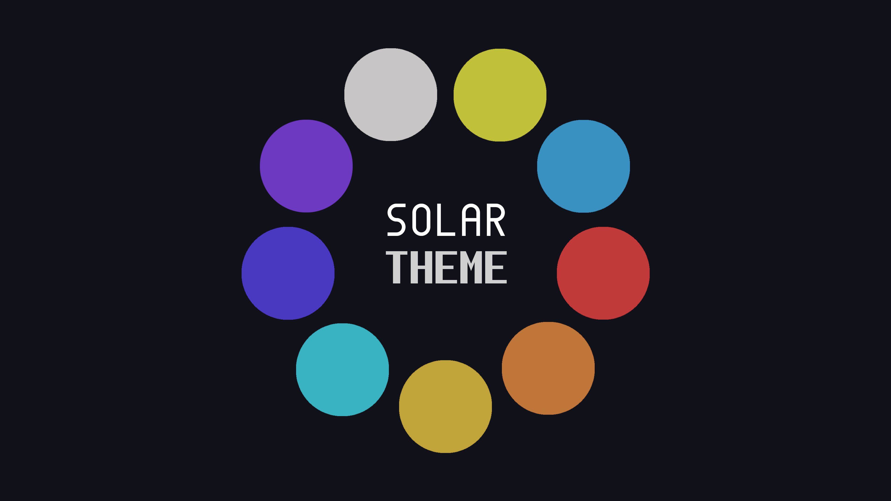

# solar-theme
Introducing the Solar Theme : a dark, moody theme where each color embodies a distant planet's mystique. 
Explore the depths of Neptune's brooding blues and Saturn's haunting elegance in this celestial palette. Let darkness unveil the hidden allure of our cosmic neighbors.

# color pallete

Background: #101119, echoing the void of space.
Current Line: ?
Selection: ?
Foreground: ?
Comment: ?
Mercury: - #c7c5c5, reflecting its rocky surface and proximity to the Sun.
Venus: - #c1c139, representing its thick atmosphere and intense heat.
Earth: - #3991c1, symbolizing its oceans, landmasses, and atmosphere.
Mars: #c13939, reflecting its iron-rich soil and dusty surface.
Jupiter: #c17639, reminiscent of its iconic storm clouds and gas giant atmosphere.
Saturn: #c1a439, evoking its rings and gas giant presence.
Uranus: #39b3c1, mirroring its icy composition and unique axial tilt.
Neptune: #4939c1, representing its icy atmosphere and remote location in the outer solar system.
Pluto: #6d39c1, manifesting the distant hues of its icy plains and rugged terrain.
